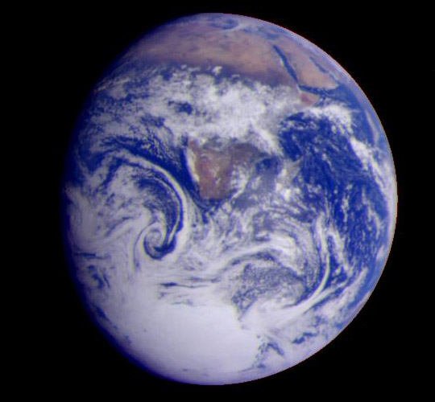

<bf>Current areas of research:</bf>
<ul>
  <li>Long-period temperate planets around M dwarf stars</li>
  <li>Young planetary systems</li>
  <li>Evolution and Diversification of Planet-Forming Disks</li>
</ul>
<section id="two">
<!-- <h2>Recent Work</h2>
 -->

	 
<article class="6u 12u$(xsmall) work-item">

<h3><a href=./temperate.html>Long-Period Temperate Planets</a></h3>
</article>
							
<article class="6u$ 12u$(xsmall) work-item">

<h3><a href = ./disks.html>Evolution and Diversification of Protoplanetary Disks</a></h3>
</article>

<article class="6u 12u$(xsmall) work-item">

<h3><a href=./young.html>Young Planetary Systems</a></h3>
</article>
							

					</section>
